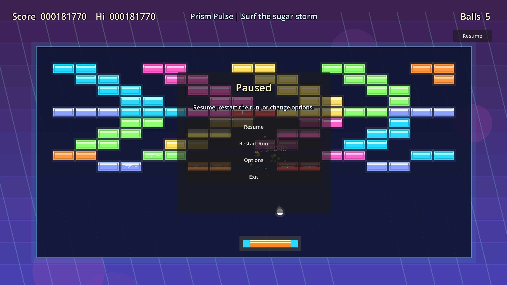

# Candy Breakout Bombast

Native Godot breakout built to channel DX-Ball 2 energy with louder candy colors, screen shake, particle bursts, multi-ball, lasers, explosive bricks, and falling power-ups.

  

## Play Now

1. Go to [Releases](https://github.com/soolafsen/CodexBreakout/releases/latest).
2. Download `CandyBreakoutBombast-win64.zip`.
3. Unzip it.
4. Double-click `CandyBreakoutBombast.exe`.

No Godot install is required for players.

For source builds and export details, see [Development](docs/development.md).

## Controls

- `Mouse` or `A` / `D` / `Left` / `Right`: move paddle
- `Click` or `W` or `Space`: launch ball / continue / restart
- `F`: fire lasers when laser mode is active
- `Esc` or `P`: pause / resume

## Notes

- High score is saved locally in Godot `user://progress.cfg`.
- The current build includes an in-game menu with speed, key sensitivity, cheat mode, music, SFX, volume, pause, and exit.
- Ralph tracking lives in `.agents/tasks/prd-candy-breakout-bombast.json`.
